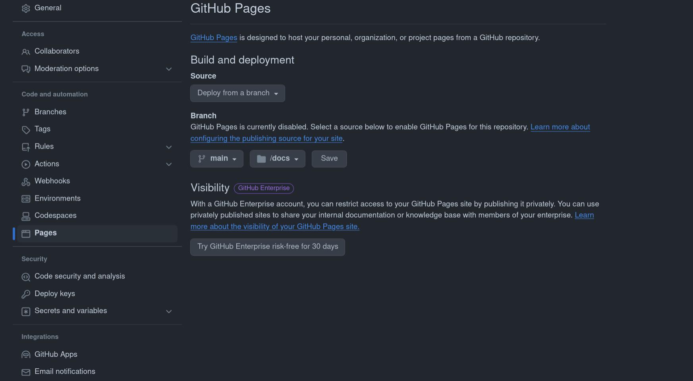

# Testing the docs

I am testing docs for this repo. Actual content will be posted soon.

Visit your repository’s settings tab and select master branch /docs folder as the GitHub Pages source. Click save, and you’re done.

<picture>
 <source media="(prefers-color-scheme: dark)" srcset="img/Screenshot.png">
 <source media="(prefers-color-scheme: light)" srcset="img/Screenshot.png">
 
</picture>

GitHub Pages will read the contents of your /docs directory, convert the index.md into HTML, and publish the results at your GitHub Pages URL.

This will generate the most basic HTML output that you can further customize with templates, CSS, and other features available in Jekyll. To see examples of what all is possible, take a look at the [GitHub Pages Showcase](https://github.com/collections/github-pages-examples). 

